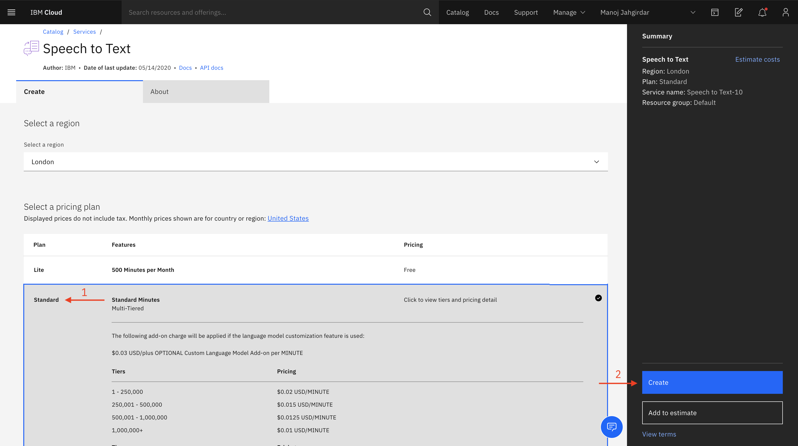
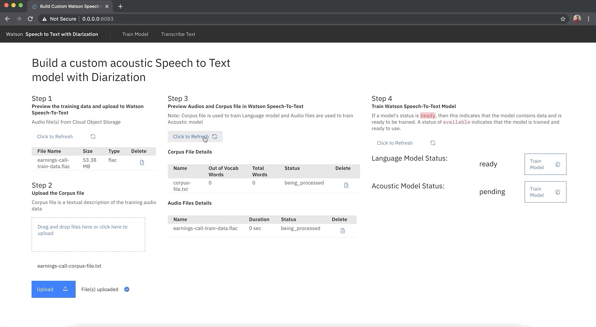
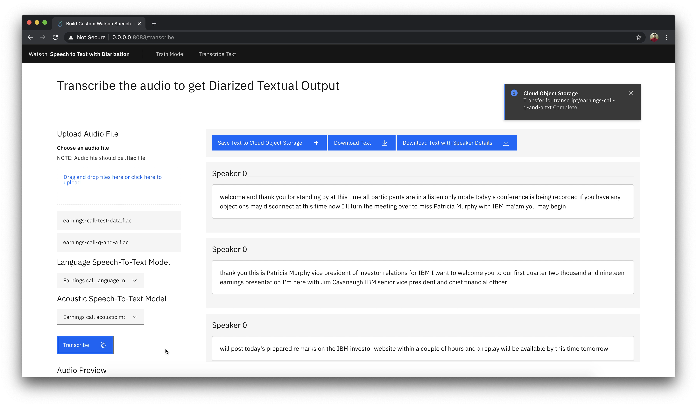

# Build a Custom Speech to Text model with diarization capabilities

This Code Pattern is part of the series [Extracting Textual Insights from Videos with IBM Watson]()


In this code pattern, given a corpus file and audio recordings of a meeting or classroom, we train custom language and acoustic speech to text model to transcribe audios to get diarized textual output.

>Speaker Diarization is a process of extracting multiple speakers information from an audio. [Learn more](https://en.wikipedia.org/wiki/Speaker_diarisation)

>Custom language model is built to recognize the **out of vocabulary**  words from the audio. [Learn more](https://cloud.ibm.com/docs/speech-to-text?topic=speech-to-text-languageCreate)

>Custom accoustic model is built to recognize the **accent** of the speaker from the audio. [Learn more](https://cloud.ibm.com/docs/speech-to-text?topic=speech-to-text-acoustic)

When you have completed this code pattern, you will understand how to:

* Use Watson Speech to Text service to convert the human voice into the written word.
* Connect applications directly to Cloud Object Storage.

<!--add an image in this path-->


<!--Optionally, add flow steps based on the architecture diagram-->
## Flow

1. User uploads corpus file to the application

2. The extracted audio from the [previous code pattern of the series](https://github.com/IBM/convert-video-to-audio) is retrived from Cloud Object Storage

3. The corpus file as well as the extracted audio are uploaded to Watson Speech To Text to train the custom model

4. The Downloaded audio file from the [previous code pattern of the series](https://github.com/IBM/convert-video-to-audio) is transcribed with the custom Speech To Text model and the text file is stored in Cloud Object Storage

<!--Optionally, update this section when the video is created-->
# Watch the Video

[](https://www.youtube.com/watch?v=xgkYRJdBQ8E)

# Pre-requisites

1. [IBM Cloud](https://cloud.ibm.com) Account

2. [Docker](https://www.docker.com/products/docker-desktop)

3. [Python](https://www.python.org/downloads/release/python-365/)

# Steps

1. [Clone the repo](#1-clone-the-repo)

2. [Create Watson Speech To Text Service](#2-create-watson-speech-to-text-service)

3. [Add the Credentials to the Application](#3-add-the-credentials-to-the-application)

4. [Deploy the Application](#4-deploy-the-application)

5. [Run the Application](#5-run-the-application)

### 1. Clone the repo

Clone the [`build-custom-stt-model-with-diarization`](https://github.com/IBM/build-custom-stt-model-with-diarization) repo locally. In a terminal, run:

```bash
$ git clone https://github.com/IBM/build-custom-stt-model-with-diarization
```

We will be using the following datasets from the Cloud Object Storage:

1. `earnings-call-train-data.flac` - To train the speech to text model.

2. `earnings-call-test-data.flac` - To test the speech to text model.

3. `earnings-call-Q-and-A.flac` - To demonstrate the diarization capabilities.

### About the dataset

For the code pattern demonstration, we have considered `IBM Earnings Call Q1 2019` Webex recording. The data has 40min of IBM Revenue discussion, and 20+ min of Q & A at the end of the recording. We have split the data into 3 parts:

* `earnings-call-train-data.mp4` - (Duration - 24:40)
This is the initial part of the discussion from the recording which we will be using to train the custom Watson Speech To Text model in the second code pattern from the series.

* `earnings-call-test-data.mp4` - (Duration - 36:08)
This is the full discussion from the recording which will be used to test the custom Speech To Text model and also to get transcript for further analysis in the third code patten from the series.

* `earnings-call-Q-and-A.mp4` - (Duration - 2:40)
This is a part of Q & A's asked at the end of the meeting. The purpose of this data is to demonstrate how Watson Speech To Text can detect different speakers from an audio which will be demonstrated in the second code pattern from the series.

### 2. Create Watson Speech To Text Service

>NOTE: A **Standard account** is required to train a custom Speech To Text Model. There are three types of plans, Lite (FREE), Standard and Premium (PAID) for more info visit <https://cloud.ibm.com/catalog/services/speech-to-text>

* On IBM Cloud, create a [Watson Speech To Text Service](https://cloud.ibm.com/catalog/services/speech-to-text), under `Select a pricing plan` select `Standard` and click on `create` as shown.



* In Speech To Text Dashboard, Click on `Services Credentials`


- Click on `New credential` and add a service credential as shown. Once the credential is created, copy and save the credentials in a text file for using it in later steps in this code pattern.


### 3. Add the Credentials to the Application

- In the repo parent folder, open the **credentials1.json** file and paste the credentials copied in [step 2](#2-create-watson-speech-to-text-service) and save the file.

- In the [previous code pattern](https://github.com/IBM/convert-video-to-audio) cloned repo, you will have updated **credentials.json** file with cloud object storage credentials. Copy that file and paste it in parent folder of the repo that you cloned in [step 1](#1-clone-the-repo).

### 4. Deploy the Application

<details><summary><b>With Docker Installed</b></summary>

- Build the **Dockerfile** as follows :

```bash
$ docker image build -t stt-with-diarization .
```

- once the dockerfile is built run the dockerfile as follows :

```bash
$ docker run -p 8080:8080 stt-with-diarization
```

- The Application will be available on <http://localhost:8080>

</details>

<details><summary><b>Without Docker </b></summary>

- Install the python libraries as follows:

    - change directory to repo parent folder
    
    ```bash
    $ cd build-custom-stt-model-with-diarization/
    ```

    - use `python pip` to install the libraries

    ```bash
    $ pip install -r requirements.txt
    ```

- Finally run the application as follows:

```bash
$ python app.py
```

- The Application will be available on <http://localhost:8080>

</details>

### 5. Run the Application

- Visit  <http://localhost:8080> on your browser to run the application.


#### We can Train the custom Speech To Text model in just 4 steps:

1. Delete the audio files `earnings-call-test-data.mp4` & `earnings-call-Q-and-A.mp4` as shown. 

>After clicking on delete file, it will take some time. Check logs on terminal, if required.

>We delete the `earnings-call-test-data.mp4` & `earnings-call-Q-and-A.mp4` audio files since we do not require these files for training the Speech To text Model.

>NOTE: Make sure you have downloaded the `earnings-call-test-data.flac` & `earnings-call-Q-and-A.flac` audio files in the [previous code pattern of the series](https://github.com/IBM/convert-video-to-audio). If you have not downloaded then kindly download the files before proceeding as the files will be used in later part of the code pattern. 


2. Click on the `Drag and drop files here or click here to upload`, choose the `earnings-call-corpus-file.txt` corpus file from `data` directory in the repo parent folder and click on `Upload` as shown.

> Corpus file is used to train the language model with `out of vocabulary words`. In this code pattern we train the model with **7** `out of vocabulary words` like _`Kubernetes`, `Data and AI`, `RedHat`, etc._


3. It will take about 1-2 min to upload the `earnings-call-train-data.flac` audio file and `earnings-call-corpus-file.txt` corpus file. The corpus file and audio files are now being uploaded to the Speech-To-Text service. Once it is uploaded successfully click on `Refresh` as shown.



> Audio file is used to train the acoustic model which understands the accent of the speaker.

4. The status of language model and acoustic model will be `ready` at this point, indicating that the model contains data and is ready to be trained. Click on both the `Train Model` buttons to train the language model and acoustic model as shown.

> It will take about 5 min to train both the models.<br> Please be patient.


- Once the training indicator becomes blank, reload the application as shown.


- The custom Speech To Text model is now ready to use.

#### Transcribe audio to get Diarized textual output as follows:

- Click on the `Transcribe audio` and upload the `earnings-call-Q-and-A.flac` which you will have downloaded in the [previous code pattern of the series](https://github.com/IBM/convert-video-to-audio). Verify the language Speech-To-Text Model and acoustic Speech-To-Text model are populated and click on `Transcribe`.

>NOTE: It will take about 1-2 Min to transcribe the `earnings-call-Q-and-A.flac` audio file. <br> Please be patient.


- Once the audio is transcribed you can see that the Speech To Text model has detected multiple speakers `Speaker 0` and `Speaker 1` from the audio file.


> The data that we have provided to train the model is just `24:40` Minutes and hence the Transcription and Diarization may not be 100% accurate. Provided more training data, the accuracy will increase.

- Click on `Save Text to Cloud Object Storage` as the transcribed text file will be consumed in the [next code pattern of the series](https://github.com/IBM/use-advanced-nlp-and-tone-analyser-to-analyse-speaker-insights) to extract insights.

>After clicking on `Save Text to Cloud Object Storage`, it will take some time. Check logs on terminal, if required. Once it is saved to your Cloud Object Storage you will get a notification as shown.


- Similarly upload the `earnings-call-test-data.flac` which you will have downloaded in the [previous code pattern of the series](https://github.com/IBM/convert-video-to-audio). Verify the Language Speech-To-Text Model and Acoustic Speech-To-Text model and click on `Transcribe`.

>NOTE: The application will always consider the last uploaded file.

>NOTE: It will take about 15-20 Min to transcribe the `earnings-call-test-data.flac` audio file.<br> Please be patient.


- Since there is only one speaker in `earnings-call-test-data.flac`, you can see that the model has detected a single speaker `Speaker 0`.



- Click on `Save Text to Cloud Object Storage` as the transcribed text file will be consumed in the [next code pattern of the series](https://github.com/IBM/use-advanced-nlp-and-tone-analyser-to-analyse-speaker-insights) to extract insights.


### Summary

We have seen how to build a custom speech to text model to transcribe audio and get diarized textual output. In the [next code pattern of the series](https://github.com/IBM/use-advanced-nlp-and-tone-analyser-to-analyse-speaker-insights) we will learn how extract meaningful insights from the transcribed text files.

<!-- keep this -->
## License

This code pattern is licensed under the Apache License, Version 2. Separate third-party code objects invoked within this code pattern are licensed by their respective providers pursuant to their own separate licenses. Contributions are subject to the [Developer Certificate of Origin, Version 1.1](https://developercertificate.org/) and the [Apache License, Version 2](https://www.apache.org/licenses/LICENSE-2.0.txt).

[Apache License FAQ](https://www.apache.org/foundation/license-faq.html#WhatDoesItMEAN)
